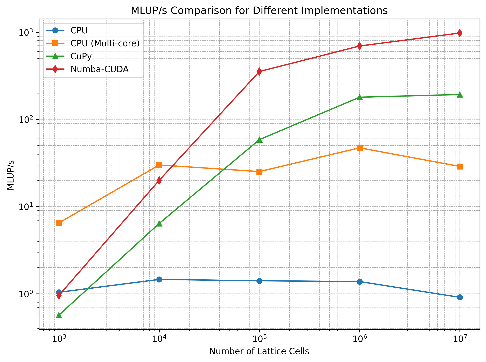
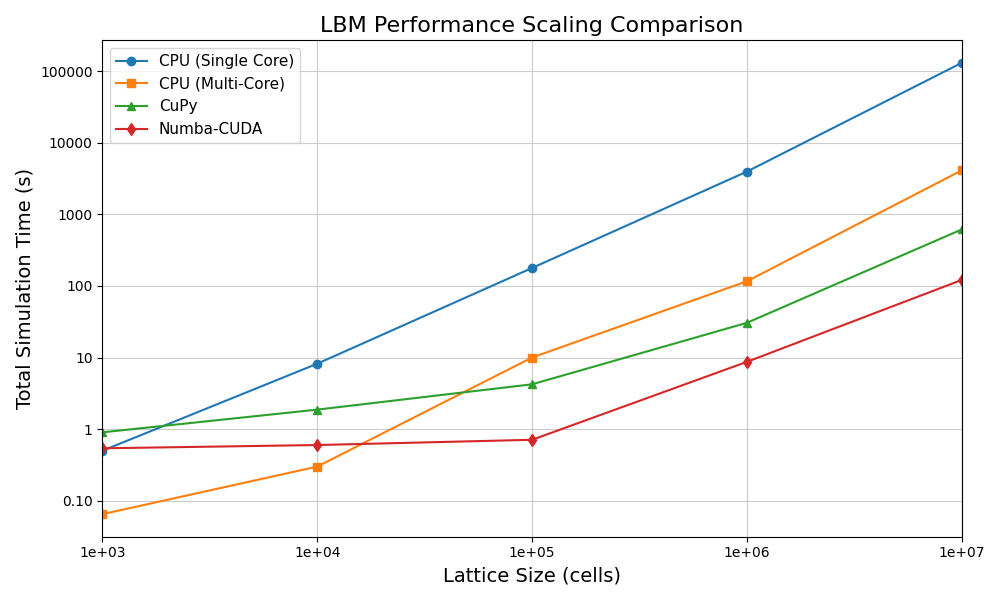

# Python LBM
A research-oriented Python implementation of the Lattice Boltzmann Method (LBM) for incompressible and weakly compressible flows.
Supports isentropic vortex 2D CPU (NumPy) implementation, as a means to test the LBM algorithm on a simpler test case.
For complex performance analysis, GPU parallelized versions are written using CuPy and Numba-CUDA back-ends of the taylor green vortex 3D test case (CPU). 

# Results

## Requirements

 chmod +x create_venv.sh      
 ./create_venv.sh   
 source venv/bin/activate     

# Samples

There are two sample codes:

    - isentropic_vortex.py (2D case)
    - taylor_green_vortex.py (3D case)

They will use the exporter class in order to create vtk-files.

## lattice

Is a class storing the particle distribution function (PDF) and macoscropc variables.
It contains methods for updating the data.
The PDF stores its data in a [Nx, Ny, q] or [Nx, Ny, Nz, q] (2D & 3D) array.
There is no mesh since the Nx*Ny(*Nz) number of cells are represented only by an index in the array.
For GPU purposes in Python, and array will probably have to be unrolled into a Nx*Ny(*Nz)*q array.
Either as an array of structures (AoS) or structure of arrays (SoA).
There will probably have to be two variables containing the PDF (PDF_A and PDF_B) if using the AB-pattern.

# Theory
Recommended reading:
- The Lattice Boltzmann Method - Principles and Practice, Timm Kruger.